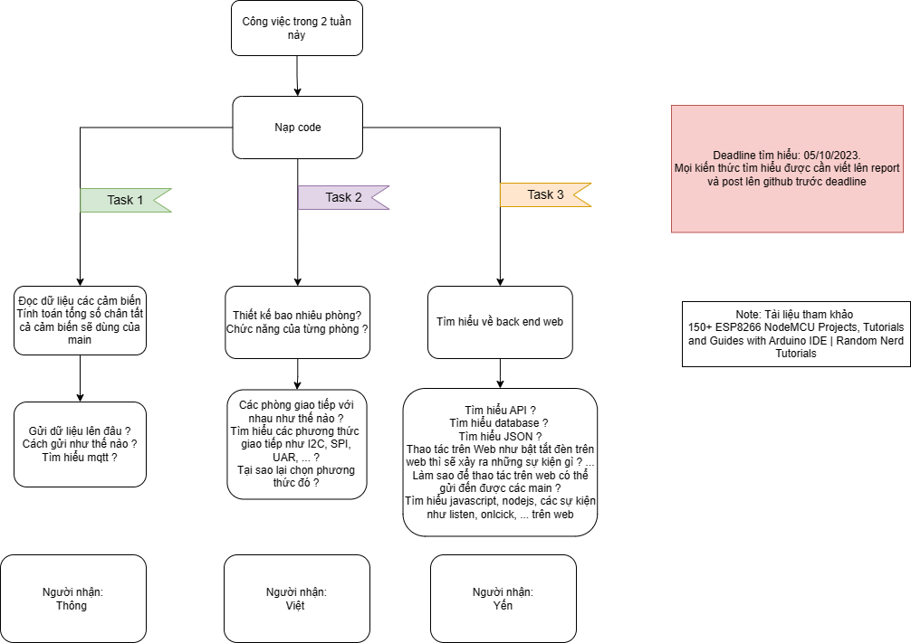

# NỘI DUNG CÁC BUỔI HỌP
**Buổi 1:**
* Thống nhất ý tưởng thiết kế các chức năng mô hình nhà thông minh ( hình minh họa trong folder IdeaForProject)
* Thống nhất linh kiện cần đặt  
* Thống nhất cách hoạt động, làm việc của nhóm

**Buổi 2:**
*Chia task tìm hiểu*
* Task 1: Thông
* Task 2: Việt
* Task 3: Yến

    

**Buổi 3:** (Deadline: 24/10/2023)
* Kết quả task của từng người
* Chia task mới
* Task 4: Design frontend - Yến
* Task5: Kết nối tất cả linh kiện lên breadboard - Thông, Việt
